# rouge-themes

Highlight themes generated by rougify.

```sh
$ rougify version
3.13.0
```

**目录**

<!-- vim-markdown-toc GFM -->

* [使用](#使用)
* [theme 列表](#theme-列表)
    * [base16](#base16)
    * [base16.dark](#base16dark)
    * [base16.light](#base16light)
    * [base16.monokai](#base16monokai)
    * [base16.monokai.dark](#base16monokaidark)
    * [base16.monokai.light](#base16monokailight)
    * [base16.solarized](#base16solarized)
    * [base16.solarized.dark](#base16solarizeddark)
    * [base16.solarized.light](#base16solarizedlight)
    * [bw](#bw)
    * [colorful](#colorful)
    * [github](#github)
    * [gruvbox](#gruvbox)
    * [gruvbox.dark](#gruvboxdark)
    * [gruvbox.light](#gruvboxlight)
    * [igorpro](#igorpro)
    * [magritte](#magritte)
    * [molokai](#molokai)
    * [monokai](#monokai)
    * [monokai.sublime](#monokaisublime)
    * [pastie](#pastie)
    * [thankful_eyes](#thankful_eyes)
    * [tulip](#tulip)
* [生成方法](#生成方法)
    * [自动](#自动)
    * [手动](#手动)

<!-- vim-markdown-toc -->

## 使用

在 dist 文件夹里挑选好需要引用的 theme 后，可在网页里直接引用，比如引用 `monokai.sublime`：

```HTML
<link rel="stylesheet" href="https://cdn.jsdelivr.net/gh/mzlogin/rouge-themes@master/monokai.sublime.css">
```

## theme 列表

### base16

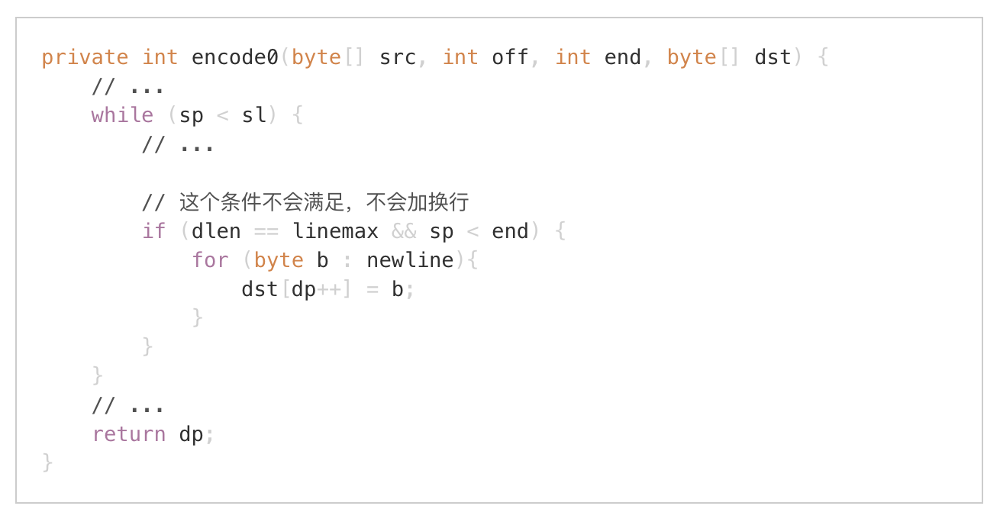

### base16.dark

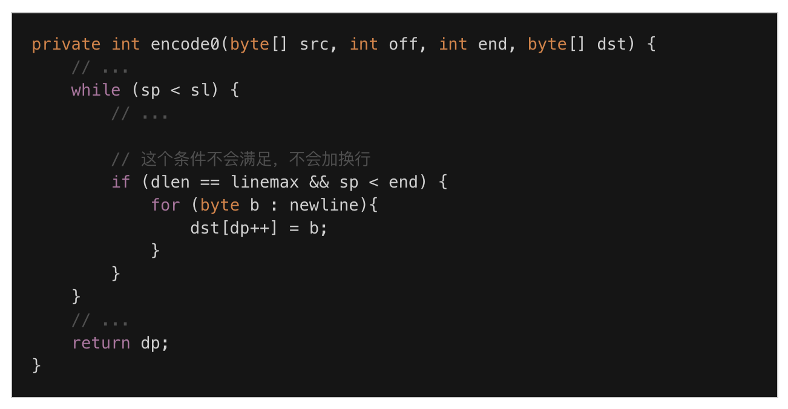

### base16.light

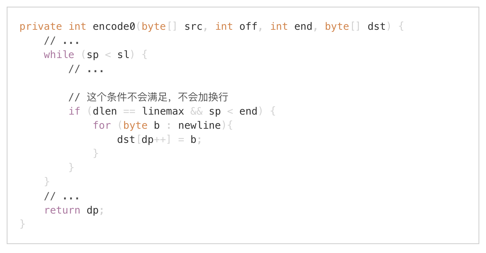

### base16.monokai


### base16.monokai.dark

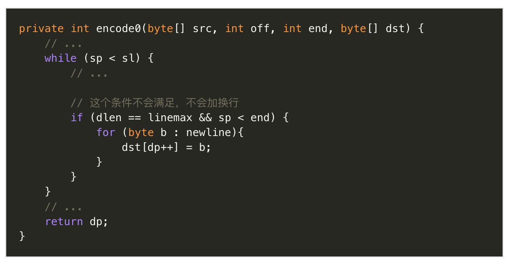

### base16.monokai.light

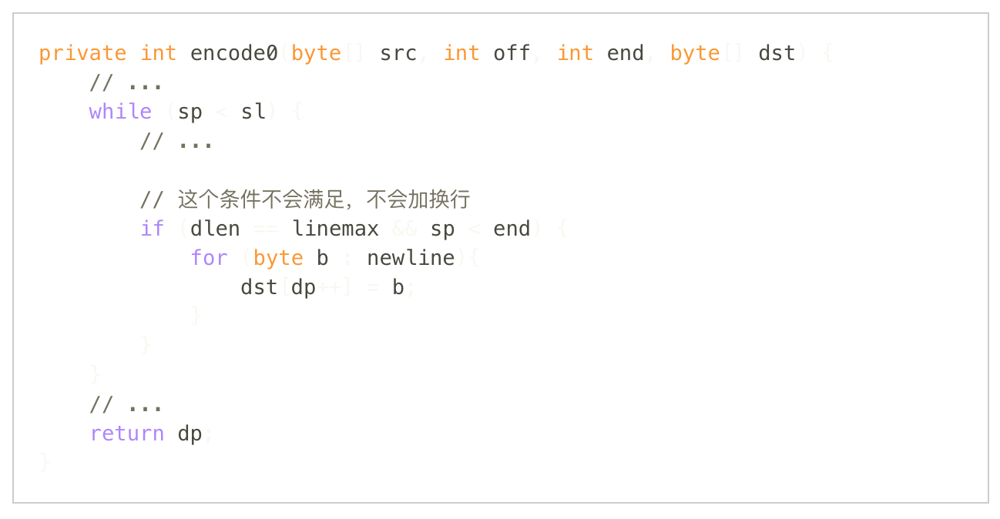

### base16.solarized

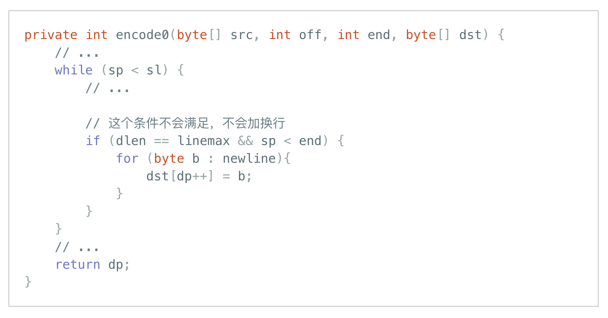

### base16.solarized.dark

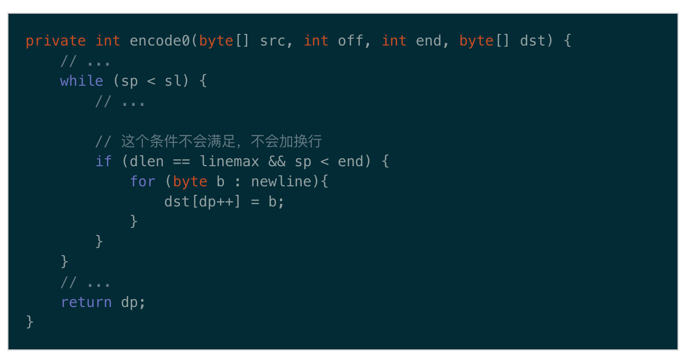

### base16.solarized.light

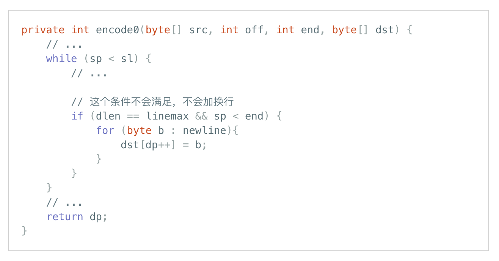

### bw


### colorful

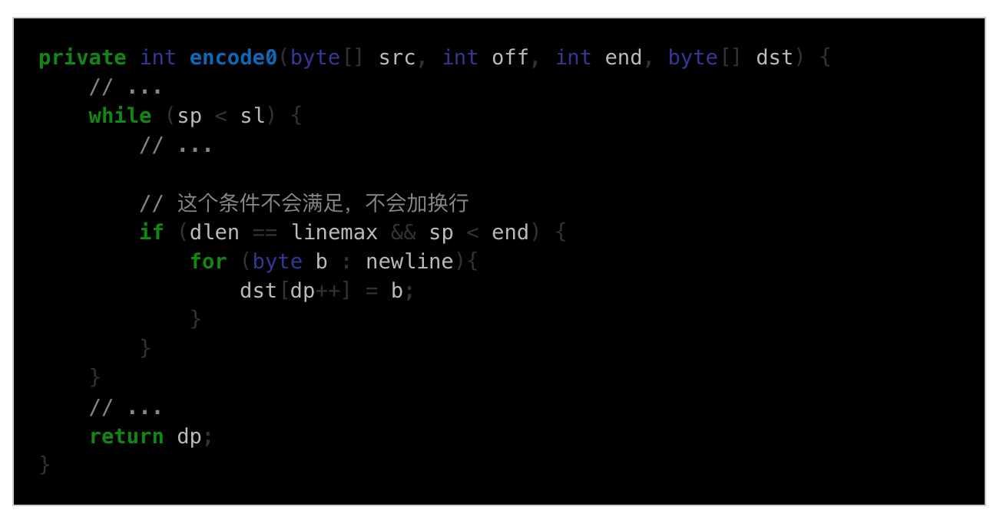

### github

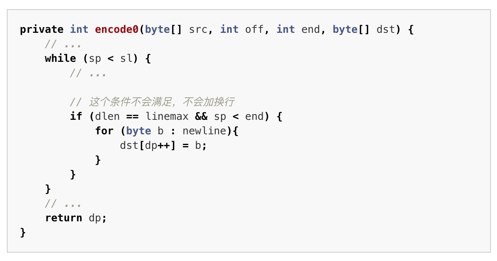

### gruvbox

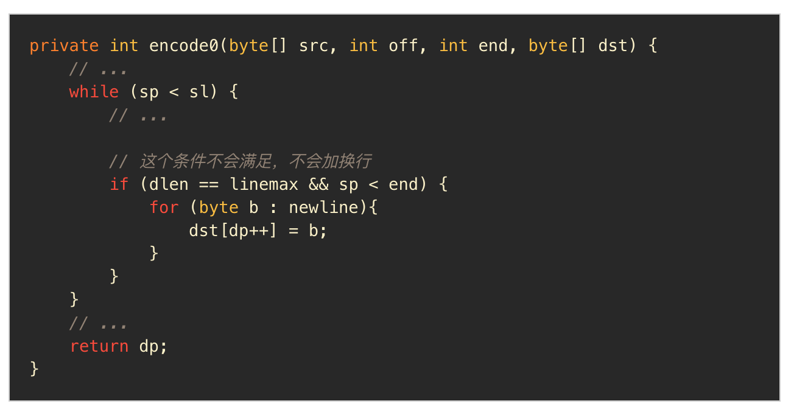

### gruvbox.dark

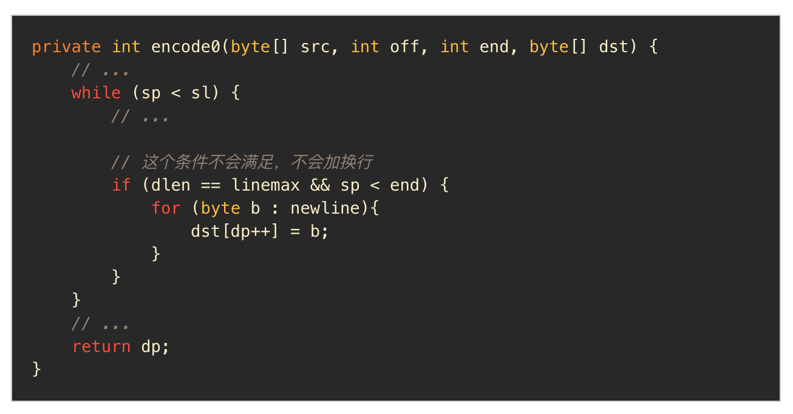

### gruvbox.light

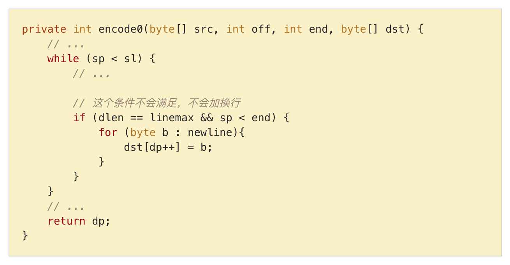

### igorpro


### magritte


### molokai

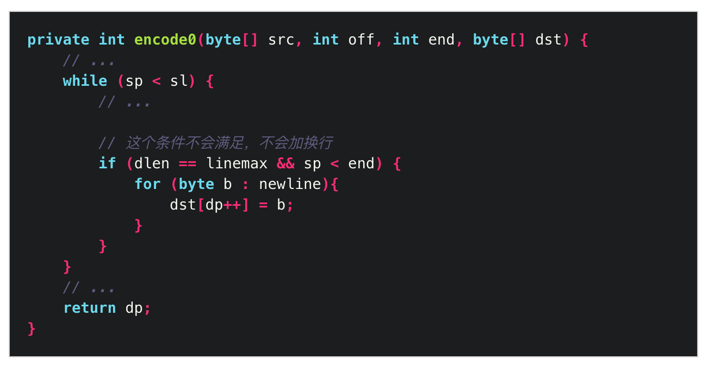

### monokai

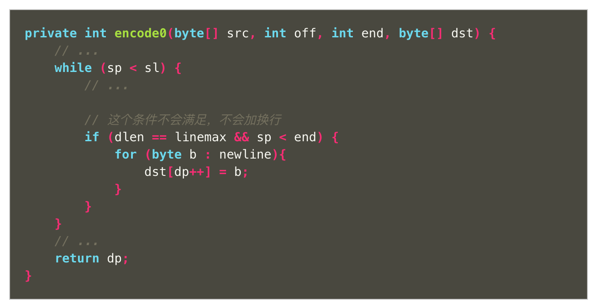

### monokai.sublime

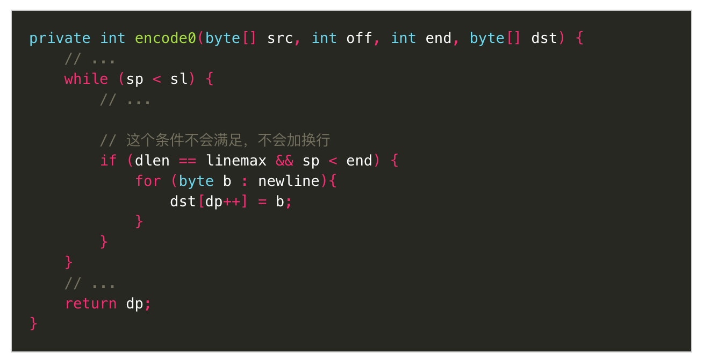

### pastie

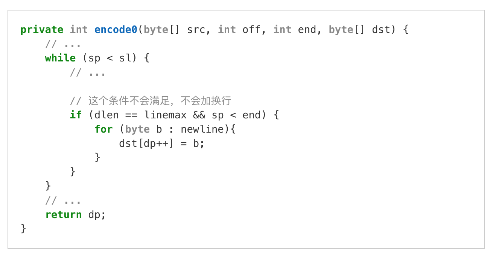

### thankful_eyes

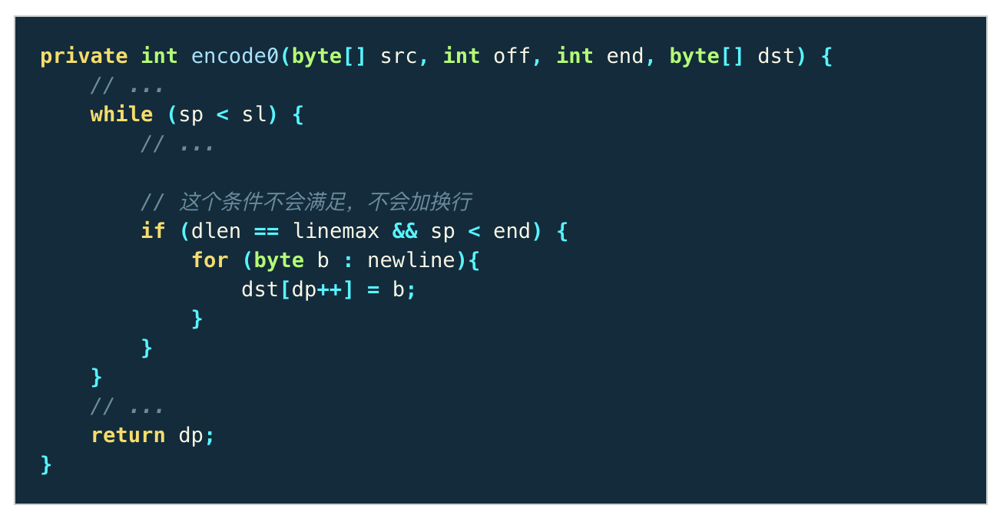

### tulip

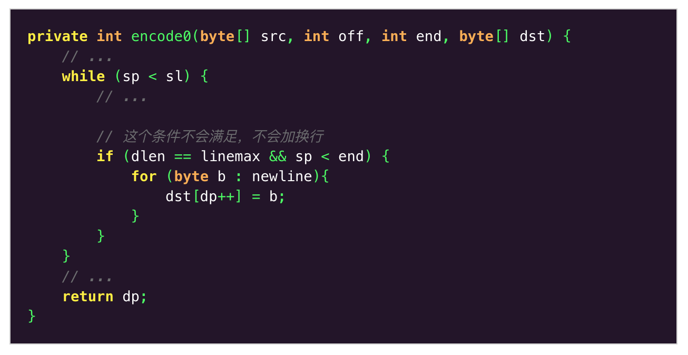

## 生成方法

首先需要安装 rouge：

```sh
gem install rouge
```

### 自动

```sh
python3 generate.py
```

### 手动

1. 获取 available themes：

    ```sh
    rougify help style
    ```

2. 选择一个喜欢的 theme，然后输出到 CSS 文件：

    ```sh
    rougify style monokai.sublime > dist/monokai.sublime.css
    ```
